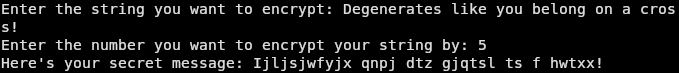

# ave-pysar

Ave Pysar! (Fallout: New Vegas reference...) is a *very* simple Python script which takes user input as a string and encrypts it using the famous Caesar cipher method. It's a pretty amateurish project idea but I did have a good bit of fun writing it; you could probably tell...